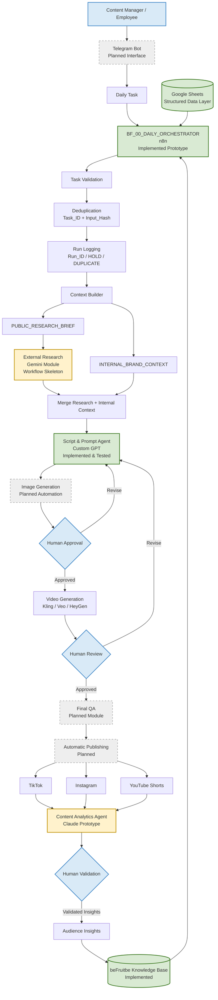

# beFruitbe AI Content Pipeline — Architecture

This diagram shows the overall architecture of the project and distinguishes between implemented, prototyped and planned components.



## Status Legend

- **Green** — implemented / tested during the project
- **Yellow** — prototype or partially implemented
- **Grey dashed** — designed but not completed
- **Blue** — human decision / human-in-the-loop

## Core Architecture Principle

The system was designed around three ideas:

```text
Structured Data
      +
Specialized AI Components
      +
Human Approval
```

rather than a single:

```text
Prompt → AI → Video
```

## Feedback Loop

The long-term architecture was designed to create the following cycle:

```text
Create
  ↓
Publish
  ↓
Measure
  ↓
Analyze
  ↓
Human Validate
  ↓
Store Insights
  ↓
Create Better Content
```

This allows future content decisions to use both:

- verified brand knowledge;
- actual audience-performance data.
