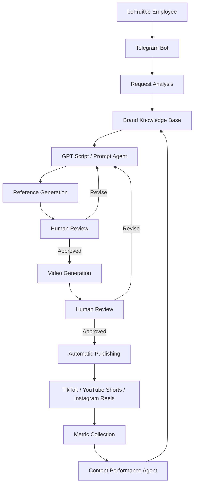

# Project Architecture

[Русская версия](../ru/architecture.md)

## beFruitbe AI Content Pipeline

This document describes the technical concept behind the beFruitbe AI Content Pipeline and distinguishes between:

- implemented components;
- prototypes / Proofs of Concept;
- components designed for the future full-scale system.

The project remained at the research and prototyping stage and was not deployed as a complete production system.

---

## 1. Architecture Concept

The main goal of the system was to allow a company employee to describe a desired video in natural language and then automatically pass this request through several AI-powered stages.

The proposed complete process was:

```text
Employee Request
        ↓
Telegram Bot
        ↓
Request Analysis
        ↓
beFruitbe Knowledge Base
        ↓
GPT Script / Prompt Agent
        ↓
Script + Generation Prompt
        ↓
Visual Generation
        ↓
Human Approval
        ↓
Video Generation
        ↓
Human Approval
        ↓
Automatic Publishing
        ↓
Performance Analysis
```

The key architecture principle was:

> AI automates individual stages while humans remain responsible for important creative and final decisions.

---

## 2. Component Status

Different parts of the architecture reached different levels of implementation.

### Implemented

- collection of company materials;
- knowledge-base structure;
- local folders containing project materials;
- Google Sheets for structured information;
- a Knowledge Base loaded into a Custom GPT;
- a Custom GPT for creating scripts and video-generation prompts;
- production and testing of 9 real video examples.

### Prototyped / Proof of Concept

- the logic for retrieving information from Google Sheets and passing it to an AI stage;
- a small n8n workflow;
- a content-performance analysis agent in Claude;
- the concept of using knowledge-base data within an automated workflow.

### Designed but not fully implemented

- a Telegram bot as the main user interface;
- complete automated video generation from request to result;
- approval cycles through Telegram;
- automatic publishing;
- automatic performance-metric collection;
- a feedback loop influencing future generations.

---

## 3. Knowledge Base

The knowledge base was one of the core components of the proposed system.

Instead of manually providing the AI model with all brand information for every request, the goal was to create a persistent source of brand context.

At the prototype stage, the information was stored mainly in:

- local folders containing files and project materials;
- Google Sheets containing structured information.

### The knowledge base included

- brand history;
- company materials;
- interviews with both founders;
- product information;
- flavours;
- photographs;
- logos;
- Tone of Voice;
- other brand-related materials.

To collect the required information, I first prepared separate documents containing questions and data requirements.

These were sent to the company owner.

After receiving the initial materials, I conducted additional interviews with the founders and expanded the knowledge base.

---

## 4. Knowledge Base inside the Custom GPT

The collected information was structured and uploaded to the Knowledge section of the Custom GPT I created.

This allowed the GPT to use beFruitbe-specific information as context when processing new user requests.

The simplified logic was:

```text
User Request
        +
beFruitbe Knowledge Base
        ↓
Custom GPT
        ↓
Script + Detailed Video Generation Prompt
```

The GPT therefore generated prompts not only from the user's free-form request but also from the specific context of the brand.

---

## 5. GPT Script / Prompt Agent

The Custom GPT acted as a script-writing and prompt-engineering agent.

### Input

The user described the desired video in natural language.

For example:

> Create a video involving selected characters and the beFruitbe product.

### Additional context

The GPT used the uploaded brand Knowledge Base.

### Output

The agent transformed the request into a more detailed specification for generative video models, including:

- the concept;
- scene structure;
- character actions;
- visual details;
- required brand elements;
- a detailed generation prompt.

The main purpose of this component was to hide prompt-engineering complexity from the end user.

The employee should be able to describe the task naturally while the agent converts it into a more technically detailed generation specification.

---

## 6. n8n Proof of Concept

I created a small workflow / Proof of Concept in n8n to explore automation between different stages of the system.

The purpose was to test the basic idea of passing information between structured data sources and AI components.

The explored flow looked approximately like this:

```text
Excel / Google Sheets
        ↓
Retrieve information from the knowledge base
        ↓
User Request
        ↓
GPT Agent
        ↓
Create a prompt using the Knowledge Base
        ↓
Next generation stage
```

In the proposed full architecture, the process would continue as:

```text
GPT Agent
    ↓
Generation Prompt
    ↓
HeyGen / Generative Video System
    ↓
References / Avatars / Video
    ↓
Telegram Bot
    ↓
User Approval
```

Important: this complete chain was not deployed as a production workflow.

The n8n implementation was an early Proof of Concept used to explore how structured information could be passed into subsequent AI stages.

---

## 7. Video Generation

The project experiments used:

- Kling AI;
- Google Veo;
- HeyGen.

A fully automated integration of all video-generation services into n8n was not implemented.

During the Proof-of-Concept stage, the actual videos were produced through a human-guided AI workflow.

This made it possible to first understand the real production process and identify problems that a future automated system would need to handle.

---

## 8. Human-in-the-Loop

The architecture intentionally included checkpoints where a human would make the final decision.

For example:

```text
AI creates references
        ↓
Human approves
        ↓
AI creates video
        ↓
Human reviews
        ↓
Revision or approval
```

This was necessary because:

- AI could generate visual artifacts;
- characters could become inconsistent;
- voice-generation problems could occur;
- text on product cans could become unreadable;
- models could modify real packaging elements.

For this reason, complete autonomy was not considered optimal during the prototype stage.

---

## 9. Telegram as the User Interface

A Telegram bot was designed as the main interface for the future system.

The Telegram bot itself was not fully implemented during the current Proof of Concept.

The proposed interaction was:

```text
Employee
    ↓
Sends a request in Telegram
    ↓
AI processes the task
    ↓
System returns several references
    ↓
Employee selects an option
    ↓
System generates the video
    ↓
Employee reviews it
    ↓
System performs revisions
    ↓
Final video
```

This would prevent the employee from having to work directly with n8n, GPT, HeyGen and the other technical components.

The complexity of the system would remain behind the Telegram interface.

---

## 10. Proposed Production Architecture

The complete system was designed approximately as follows:



The final transition:

```text
Content Performance Agent → Knowledge / future decisions
```

was intended to create a feedback loop.

The system could use insights from previous content performance when preparing future videos.

---

## 11. Feedback Architecture

The long-term project concept included the following cycle:

```text
Generate
    ↓
Publish
    ↓
Measure
    ↓
Analyze
    ↓
Learn
    ↓
Generate Better Content
```

I created a prototype of a separate content-analysis agent in Claude for this purpose.

It was intended to analyze metrics such as:

- views;
- likes;
- engagement;
- relative performance of different videos.

Because the complete publishing system was never launched, real performance data was not yet available for this agent.

It therefore remained at the prototype stage.

---

## 12. How the Architecture Changed During the Project

Initially, the idea of an “AI content factory” appeared relatively straightforward:

```text
Request → AI → Video
```

Practical experimentation showed that the real workflow was significantly more complex.

Additional requirements emerged:

- managing brand context;
- working with real product assets;
- approving characters;
- controlling generation prompts;
- correcting visual artifacts;
- controlling text on product packaging;
- handling voice generation separately;
- lip sync;
- multiple video-generation iterations;
- human approval.

As a result, the architecture gradually became a multi-stage system.

This was one of the key outcomes of the Proof-of-Concept stage: before building the full system, the project revealed the actual stages of the process and helped identify which parts could be automated and where human control remained necessary.

---

## 13. Current Status

At the end of the Proof-of-Concept stage, the following components actually existed:

**Existing components:**

- structured brand materials;
- a Knowledge Base;
- a Custom GPT;
- a content-analysis agent prototype;
- an n8n Proof of Concept;
- tested AI-video workflows;
- 9 videos accepted by the company.

**Designed components:**

- Telegram interface;
- end-to-end automation;
- automatic publishing;
- automated analytics collection;
- complete feedback loop.

The full production system was not deployed because after the prototype stage the company decided to further refine which parts of the process should be automated.
