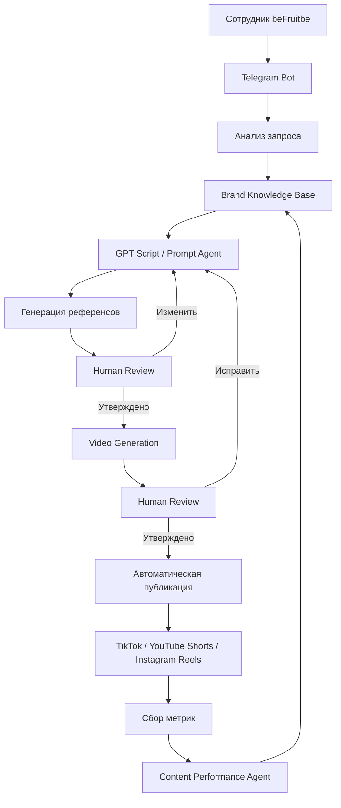

# Архитектура проекта

[English version](../en/architecture.md)

## beFruitbe AI Content Pipeline

В этом документе описана техническая концепция AI Content Pipeline для бренда beFruitbe, а также разделены:

- реализованные компоненты;
- прототипы / Proof of Concept;
- компоненты, которые проектировались для полной версии системы.

Проект находился на стадии исследования и прототипирования и не был развёрнут как полноценная production-система.

---

## 1. Общая идея архитектуры

Основная задача системы — позволить сотруднику компании формулировать запрос на создание видеоролика обычным языком, а затем автоматически передавать этот запрос через несколько AI-этапов.

Предполагаемый полный процесс:

```text
Запрос сотрудника
        ↓
Telegram-бот
        ↓
Анализ запроса
        ↓
База знаний beFruitbe
        ↓
GPT-сценарист / Prompt Agent
        ↓
Промпт и сценарий
        ↓
Генерация визуальных материалов
        ↓
Утверждение человеком
        ↓
Генерация видео
        ↓
Утверждение человеком
        ↓
Автоматическая публикация
        ↓
Анализ результатов
```

Ключевой принцип архитектуры:

> AI автоматизирует отдельные этапы, а человек сохраняет контроль над креативными и финальными решениями.

---

## 2. Статусы компонентов

Архитектура включала компоненты на разных стадиях готовности.

### Реализовано

- сбор материалов компании;
- структура базы знаний;
- локальные папки с материалами;
- использование Google Sheets для структурированных данных;
- Knowledge Base, загруженная в Custom GPT;
- Custom GPT для создания сценариев и промптов;
- производство и тестирование 9 реальных видеороликов.

### Прототипировано / Proof of Concept

- логика передачи данных из Google Sheets в AI-этап;
- небольшой workflow в n8n;
- агент анализа эффективности контента в Claude;
- логика использования данных базы знаний внутри автоматизированного workflow.

### Спроектировано, но полностью не реализовано

- Telegram-бот как единая точка взаимодействия с системой;
- полностью автоматическая генерация ролика от запроса до результата;
- автоматическое согласование через Telegram;
- автоматическая публикация роликов;
- автоматический сбор метрик;
- feedback loop, влияющий на следующие генерации.

---

## 3. База знаний

База знаний являлась одним из основных компонентов системы.

Вместо того чтобы каждый раз передавать AI-модели всю информацию о бренде вручную, задача заключалась в создании постоянного источника брендового контекста.

На стадии прототипа данные хранились в двух основных форматах:

- локальные папки с файлами и материалами;
- Google Sheets со структурированной информацией.

### В базу знаний входили

- история бренда;
- материалы компании;
- интервью с двумя владельцами;
- информация о продуктах;
- вкусы;
- фотографии;
- логотипы;
- Tone of Voice;
- другие брендовые материалы.

Для сбора данных я сначала подготовил отдельные файлы с вопросами и требованиями к информации.

Эти материалы были переданы владельцу компании.

После получения первичной информации я провёл дополнительные интервью с владельцами бренда и дополнил базу знаний.

---

## 4. Knowledge Base внутри Custom GPT

Собранная информация была структурирована и загружена в Knowledge созданного мной Custom GPT.

Это позволяло GPT использовать информацию beFruitbe как контекст при обработке новых пользовательских запросов.

Упрощённо логика выглядела так:

```text
Запрос пользователя
        +
Knowledge Base beFruitbe
        ↓
Custom GPT
        ↓
Сценарий + подробный промпт для видеогенерации
```

Таким образом, GPT должен был создавать промпты не только на основе свободного запроса пользователя, но и учитывать информацию о конкретном бренде.

---

## 5. GPT-сценарист / Prompt Agent

Custom GPT выполнял роль сценариста и prompt-engineering агента.

### Входные данные

Пользователь описывал обычным языком, какой ролик хочет получить.

Например:

> Сделай ролик с определёнными персонажами и продуктом beFruitbe.

### Дополнительный контекст

GPT использовал загруженную Knowledge Base бренда.

### Результат

На выходе агент формировал более подробное задание для генеративных video-моделей:

- идею;
- структуру сцены;
- действия персонажей;
- визуальные детали;
- необходимые элементы бренда;
- подробный генерационный промпт.

Главная задача этого компонента — скрыть от конечного сотрудника сложность prompt engineering.

Пользователь должен был описывать задачу обычным языком, а агент самостоятельно превращал её в технически более подробное задание.

---

## 6. n8n Proof of Concept

Для исследования автоматизации я создал небольшую схему / Proof of Concept в n8n.

Она была нужна для проверки самой логики передачи информации между этапами системы.

Исследуемая цепочка выглядела примерно так:

```text
Excel / Google Sheets
        ↓
Получение данных из базы
        ↓
Запрос пользователя
        ↓
GPT Agent
        ↓
Создание промпта с учётом Knowledge Base
        ↓
Следующий этап генерации
```

В более полной версии архитектуры этот процесс должен был продолжаться следующим образом:

```text
GPT Agent
    ↓
Промпт
    ↓
HeyGen / генеративная video-система
    ↓
Референсы / аватары / видео
    ↓
Telegram-бот
    ↓
Проверка пользователем
```

Важно: эта полная цепочка не была запущена как production workflow.

В n8n был создан ранний Proof of Concept, который помог исследовать принцип передачи данных из структурированного источника к AI-этапам.

---

## 7. Генерация видео

В рамках исследования использовались:

- Kling AI;
- Google Veo;
- HeyGen.

Полный автоматизированный вызов всех video-сервисов из n8n реализован не был.

На стадии Proof of Concept сами ролики создавались через управляемый человеком AI-workflow.

Это позволило сначала разобраться в реальном производственном процессе и обнаружить проблемы, которые впоследствии должна была учитывать автоматизация.

---

## 8. Human-in-the-Loop

В архитектуре специально были предусмотрены контрольные точки, в которых решение должен принимать человек.

Например:

```text
AI создаёт референсы
        ↓
Человек утверждает
        ↓
AI создаёт видео
        ↓
Человек проверяет
        ↓
Исправления или утверждение
```

Такой подход был необходим по нескольким причинам:

- AI мог создавать визуальные артефакты;
- могли искажаться персонажи;
- могли возникать ошибки в озвучке;
- текст на банках иногда становился нечитаемым;
- модели могли изменять реальные элементы упаковки.

Поэтому полная автономность на стадии прототипа не рассматривалась как оптимальный вариант.

---

## 9. Telegram как пользовательский интерфейс

Telegram-бот проектировался как основной интерфейс будущей системы.

Сам Telegram-бот в рамках текущего Proof of Concept полностью реализован не был.

Предполагаемый сценарий:

```text
Сотрудник
    ↓
Пишет запрос в Telegram
    ↓
AI обрабатывает задачу
    ↓
Система отправляет несколько референсов
    ↓
Сотрудник выбирает вариант
    ↓
Система создаёт видео
    ↓
Сотрудник проверяет
    ↓
Система дорабатывает результат
    ↓
Готовый ролик
```

Таким образом, сотруднику не пришлось бы самостоятельно работать с n8n, GPT, HeyGen и другими сервисами.

Вся техническая сложность должна была находиться за интерфейсом Telegram.

---

## 10. Планируемая production-архитектура

Полная система проектировалась примерно следующим образом:



Последний переход:

```text
Content Performance Agent → Knowledge / будущие решения
```

должен был создать feedback loop.

Система могла бы учитывать результаты предыдущего контента при подготовке следующих роликов.

---

## 11. Архитектура обратной связи

В долгосрочной версии проекта предполагался цикл:

```text
Generate
    ↓
Publish
    ↓
Measure
    ↓
Analyze
    ↓
Learn
    ↓
Generate Better Content
```

Для этого я создал в Claude прототип отдельного агента анализа контента.

Он должен был работать с такими показателями, как:

- просмотры;
- лайки;
- вовлечённость;
- сравнительная эффективность разных роликов.

Поскольку полноценная система публикации не была запущена, реальных данных для работы этого агента пока не появилось.

Поэтому он остался на стадии прототипа.

---

## 12. Почему архитектура изменилась в ходе проекта

Изначально идея «контент-завода» казалась относительно прямолинейной:

```text
Запрос → AI → видео
```

Практическое тестирование показало, что реальный процесс значительно сложнее.

Возникли дополнительные задачи:

- управление бренд-контекстом;
- работа с реальными материалами продукта;
- согласование персонажей;
- контроль промптов;
- исправление артефактов;
- контроль текста на упаковке;
- отдельная работа с озвучкой;
- lip sync;
- несколько итераций видеогенерации;
- человеческое утверждение.

Поэтому архитектура постепенно стала многоэтапной.

Это стало одним из основных результатов стадии Proof of Concept: до разработки полной системы удалось выявить реальные этапы процесса и понять, какие из них можно автоматизировать, а где необходим человеческий контроль.

---

## 13. Текущий статус

На момент завершения стадии Proof of Concept:

**Реально существовали:**

- структурированные материалы бренда;
- Knowledge Base;
- Custom GPT;
- прототип аналитического агента;
- n8n Proof of Concept;
- протестированные AI-video workflows;
- 9 принятых компанией видеороликов.

**Были спроектированы:**

- Telegram-интерфейс;
- end-to-end automation;
- автоматическая публикация;
- автоматический сбор аналитики;
- полный feedback loop.

Полная production-система не была развёрнута, поскольку после стадии прототипирования компания решила дополнительно уточнить, какие части процесса целесообразно автоматизировать.
