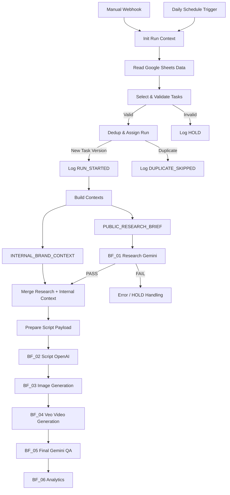

# n8n Orchestrator Technical Architecture

[Русская версия](architecture_RU.md)

## BF_00_DAILY_ORCHESTRATOR

This document describes the technical architecture of the main n8n workflow used in the **beFruitbe AI Content Pipeline**.

`BF_00_DAILY_ORCHESTRATOR` was designed as the central control layer connecting:

- content-production tasks;
- the Google Sheets data layer;
- the Knowledge Base;
- external research;
- the Script & Prompt Agent;
- image generation;
- video generation;
- QA;
- analytics.

The main orchestrator was implemented as a prototype and tested against real project data.

The preserved workflow contains **37 n8n nodes**.

---

# 1. Orchestrator Responsibility

The core idea:

```text
BF_00 does not generate the content itself.

BF_00 decides:
- which task should run;
- whether it is ready to run;
- which data it requires;
- what information may be sent to external AI systems;
- whether the same input has already been processed;
- which specialized module should execute next;
- how the execution state should be recorded.
```

Architecturally:

```text
DATA + RULES + TASK
        ↓
BF_00_DAILY_ORCHESTRATOR
        ↓
SPECIALIZED AI MODULES
```

---

# 2. High-Level Architecture



---

# 3. Node Groups

The 37 nodes in the main workflow can be grouped into:

```text
1. Triggers & Run Context
2. Data Retrieval
3. Task Validation
4. Deduplication
5. Execution Logging
6. Knowledge Filtering
7. Context Construction
8. Public Research Isolation
9. Research Routing
10. Script Payload Assembly
11. Downstream AI Routing
12. Error Routing
```

---

# 4. Triggers & Run Context

## 4.1 Daily Schedule Trigger

The primary automated trigger runs daily at:

```text
06:00
Timezone: Europe/Moscow
```

The scheduled context is initialized as:

```text
mode = scheduled
target_task_id = ""
timezone = Europe/Moscow
```

---

## 4.2 Manual Run Webhook

A manual execution path was also included.

```text
POST Webhook
        ↓
Task_ID
        ↓
Prepare Manual Context
```

The manual context contains:

```text
mode = manual
target_task_id = Task_ID from request
timezone = Europe/Moscow
```

This made it possible to trigger a specific task without waiting for the next scheduled execution.

---

## 4.3 Init Run Context

Both execution modes converge at:

```text
Init Run Context
```

The downstream pipeline is then shared between scheduled and manual runs.

---

# 5. Data Retrieval Layer

The orchestrator sequentially retrieves structured project data from Google Sheets.

Logical data areas include:

```text
Daily Tasks
Runs Log
Brands
SKUs
Claims
Audiences
Media Library
Previous Content
Messages
Knowledge
```

Architecture:

```text
Google Sheets
      ↓
Structured Project Data
      ↓
Orchestrator
```

Product data and business rules therefore remain outside the workflow instead of being hard-coded into n8n.

---

# 6. Task Selection & Validation

The central validation node:

```text
Select & Validate Tasks
```

performs several functions.

## 6.1 Task Selection

Scheduled execution:

```text
Task_Date = today
Task_Status = READY
```

Manual execution:

```text
Task_ID = target_task_id
Task_Status = READY
```

---

## 6.2 Required Fields

Required task fields include:

```text
Task_ID
Task_Date
Brand_ID
SKU_ID
Content_Type
```

If any required value is missing:

```text
task_state = HOLD
```

Otherwise:

```text
task_state = PROCESS
```

---

## 6.3 Task State Routing

A Switch node routes:

```text
PROCESS
   ↓
Deduplication

HOLD
   ↓
Log HOLD
```

Invalid tasks therefore stop before any AI execution begins.

---

# 7. Input Hash

During task validation, a hash source is constructed from fields including:

```text
Task_ID
Task_Date
Brand_ID
SKU_ID
Content_Type
Channel
Audience_ID
Brief
```

The workflow generates:

```text
Input_Hash
```

This allows the system to distinguish different versions of the same task.

For example:

```text
TASK-001 + Original Brief
```

and:

```text
TASK-001 + Updated Brief
```

represent different input states.

---

# 8. Deduplication

The:

```text
Dedup & Assign Run
```

Code node compares:

```text
Task_ID + Input_Hash
```

against the Runs Log.

```text
Task_ID + Input_Hash
        ↓
Already exists?
      ↙           ↘
    YES            NO
     ↓              ↓
DUPLICATE          NEW
```

Existing inputs receive:

```text
dedup_state = DUPLICATE
```

New inputs receive:

```text
dedup_state = NEW
```

---

# 9. Run ID

For a new execution the orchestrator generates a unique identifier:

```text
RUN_<Task_ID>_<timestamp>_<Input_Hash>
```

This connects:

- the task;
- the specific input version;
- the pipeline execution.

---

# 10. Execution Logging

Execution states are written to the Runs Log.

Examples:

```text
RUN_STARTED
HOLD
DUPLICATE_SKIPPED
```

This provides traceability for pipeline execution.

---

# 11. Knowledge Filtering

Project records are not automatically eligible for AI use simply because they exist in the database.

Messages are filtered using conditions such as:

```text
Status = APPROVED
Approved_for_Knowledge = YES
```

Knowledge records additionally require:

```text
Knowledge_Record_ID is not empty
Status = APPROVED
Approved_for_Knowledge = YES
Readiness = READY
Confidentiality != CONFIDENTIAL
```

The architecture therefore distinguishes:

```text
stored information
```

from:

```text
AI-eligible information
```

---

# 12. Build Contexts

The central:

```text
Build Contexts
```

Code node resolves task-specific entities using:

```text
Brand_ID
SKU_ID
Audience_ID
```

and assembles:

- Brand data;
- SKU data;
- Claims;
- Audience;
- Media Assets;
- Previous Content;
- Messages;
- Knowledge.

---

# 13. Data Validity

Additional gating logic checks properties such as:

```text
Status
Valid_Until / Expiry_Date
Approved_for_Knowledge
Confidentiality
Usage Rights
Advertising Rights
AI Reference Rights
```

This allows context construction to consider not only the content itself but also whether it is current and permitted for use.

---

# 14. Claims

Claims are separated into:

```text
allowed_claims
forbidden_claims
```

An allowed claim is expected to be:

```text
active
+
non-confidential
+
approved for Knowledge
+
usage-rights cleared
+
advertising-rights cleared
```

The Script Agent therefore receives both:

```text
what may be said
+
what must not be said
```

---

# 15. Media Assets

Media assets are also filtered before entering the working context.

Eligibility includes conditions such as:

```text
Knowledge-approved
non-confidential
usage rights available
```

This is particularly important for:

- packaging;
- logos;
- product photography;
- visual references;
- AI image and video generation.

---

# 16. INTERNAL_BRAND_CONTEXT

The orchestrator creates a private context package:

```text
INTERNAL_BRAND_CONTEXT
```

containing:

```text
brand
messages
knowledge
sku
allowed_claims
forbidden_claims
audience
media_assets
previous_content
```

This is the **private brand context** used by internal pipeline stages.

It is intentionally not passed directly to the external research stage.

---

# 17. PUBLIC_RESEARCH_BRIEF

In parallel, the workflow builds:

```text
PUBLIC_RESEARCH_BRIEF
```

Its purpose is to provide the external research agent with only sanitized, public-eligible context.

Fields associated with sensitive information are removed, including:

```text
Internal Price
Cost
Margin
Supplier
Personal Data
Email
Phone
Rights Documents
API Keys
Secrets
Unpublished Promotions
Confidential Notes
```

An additional key-name check attempts to remove fields that appear to contain sensitive data even when their exact names differ.

---

# 18. Public Eligibility

Records must also pass permission checks before appearing in the public context.

The gating logic considers:

```text
Knowledge approval
Current status
Confidentiality
Usage Rights
Advertising Rights
AI Reference Rights
```

The principle is:

```text
explicitly construct a safe context
```

rather than:

```text
send everything and ask the model to ignore private information
```

---

# 19. Why Two Contexts Exist

This is one of the main architectural decisions in the workflow.

```text
PUBLIC_RESEARCH_BRIEF
```

answers:

> What is the external research AI allowed to know?

while:

```text
INTERNAL_BRAND_CONTEXT
```

answers:

> What does the internal Script Agent need to know about the real brand?

---

## Context Architecture

```text
                  ┌─────────────────────┐
                  │   PROJECT DATABASE  │
                  └──────────┬──────────┘
                             ↓
                      Build Contexts
                         ↙         ↘
                        ↓           ↓
          PUBLIC_RESEARCH       INTERNAL
               BRIEF          BRAND CONTEXT
                ↓                   │
        External Research           │
                ↓                   │
           Research Packet          │
                └──────────┬────────┘
                           ↓
                    Script Agent
```

---

# 20. Research Module

The Research workflow receives only:

```text
Run_ID
Task_ID
PUBLIC_RESEARCH_BRIEF
```

through:

```text
BF_01_RESEARCH_GEMINI
```

The preserved downstream workflow is still a skeleton, while the orchestrator already implements its calling interface and result routing.

---

# 21. Research Status

After research execution:

```text
Route Research Status
```

checks:

```text
research_status = PASS
```

A successful result continues through the pipeline.

A failed research state is routed toward HOLD / error handling.

---

# 22. Merge External and Internal Context

On successful research completion:

```text
Research Packet
+
INTERNAL_BRAND_CONTEXT
```

are merged through:

```text
Merge Research + Internal Context
```

The private brand context is therefore introduced **after** the external research stage.

---

# 23. Prepare Script Payload

The next Code node prepares a payload for the Script Agent:

```text
task_id
run_id
prompt_version
instructions_version
daily_task
internal_brand_context
research_packet
warnings
```

---

# 24. Runtime Context Warnings

Before invoking the Script Agent, the workflow can generate warnings such as:

```text
brand context empty
sku context empty
no approved claims available
no rights-cleared media assets
research packet empty
prompt_version not set
instructions_version not set
```

This acts as a second validation layer focused on **AI context readiness**, rather than only task completeness.

---

# 25. Downstream AI Pipeline

The orchestrator routes the result through modular workflows:

```text
BF_02_SCRIPT_OPENAI
        ↓
BF_03_IMAGE_GENERATION
        ↓
BF_04_VEO_VIDEO_GENERATION_AND_ASSEMBLY
        ↓
BF_05_FINAL_GEMINI_QA
        ↓
BF_06_ANALYTICS
```

At the point development stopped, these downstream workflows existed as modular interfaces / skeletons.

Their internal logic was not yet completed in the preserved export.

---

# 26. Error Routing

Several downstream workflows expose an error output connected to:

```text
BF_99_ERROR_HANDLER
```

including:

```text
Research
Script
Image Generation
Video Generation
QA
Analytics
```

This indicates that error handling was designed as a separate cross-cutting workflow.

The actual Error Handler workflow was not included in the preserved export.

---

# 27. Actual Implementation Scope

## Implemented and Tested

```text
Schedule Trigger
Manual Webhook
Google Sheets data retrieval
Task selection
Task validation
Input hashing
Deduplication
Run_ID generation
Run logging
Knowledge filtering
Claims filtering
Media filtering
Rights checks
Internal context building
Public context sanitization
Research routing interface
Context merge
Script payload preparation
Downstream routing interfaces
```

## Not Fully Implemented

```text
Gemini Research internal logic
OpenAI Script workflow internal logic
Image generation automation
Veo automation
Automatic video assembly
Final QA implementation
Analytics automation
Error Handler workflow
Automatic publishing
```

---

# 28. Why a Modular Architecture

Instead of building one monolithic workflow, the system was separated into:

```text
ORCHESTRATION
RESEARCH
SCRIPT
IMAGE
VIDEO
QA
ANALYTICS
```

Advantages:

- individual stages can be tested independently;
- AI providers can be replaced more easily;
- errors are easier to isolate;
- modules can be retried independently;
- responsibilities remain clearer;
- the architecture is less tightly coupled.

---

# 29. Architecture Evolution

The project evolved from the initial mental model:

```text
Prompt → AI → Video
```

toward:

```text
Task
 ↓
Validation
 ↓
Data Governance
 ↓
Knowledge Retrieval
 ↓
Permission Checks
 ↓
Research Isolation
 ↓
Context Assembly
 ↓
Specialized AI Modules
 ↓
Human / QA Controls
 ↓
Result
```

---

# 30. Main Technical Learning

One of the main lessons from the orchestrator was:

> The AI model is only one component of an AI system.

A reliable pipeline also requires:

```text
state management
data validation
version awareness
deduplication
permissions
privacy boundaries
context engineering
logging
routing
error handling
```

`BF_00_DAILY_ORCHESTRATOR` was my first substantial attempt to implement this infrastructure around AI models.

---

# 31. Related Materials

### Public-safe JSON exports

[`workflows/`](workflows/)

### Workflow Screenshot


### n8n Overview

[README.md](README.md)

### Project Architecture

[../docs/en/architecture.md](../docs/en/architecture.md)

---

## Status

**Implemented and tested orchestration prototype**

**Downstream AI modules: designed interfaces / incomplete implementations**

The complete end-to-end production pipeline was not deployed.
