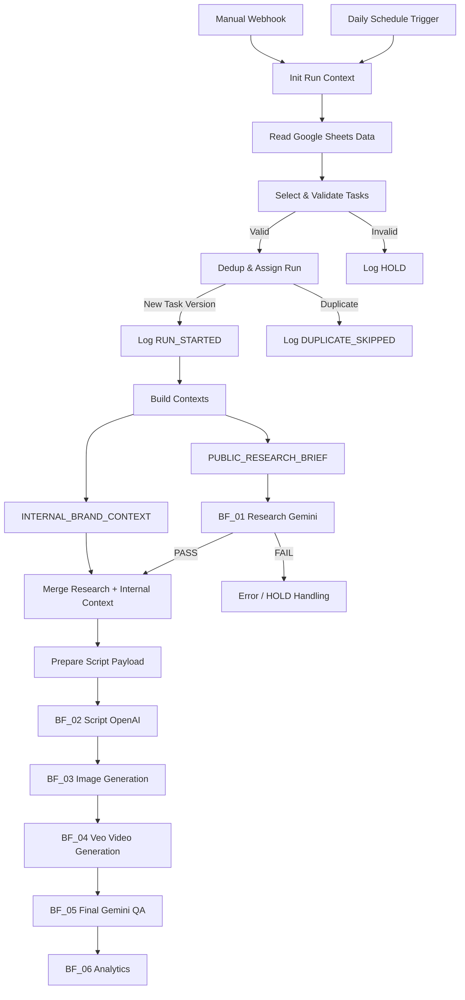

# Техническая архитектура n8n Orchestrator

[English version](architecture.md)

## BF_00_DAILY_ORCHESTRATOR

Этот документ подробно описывает архитектуру основного n8n workflow проекта **beFruitbe AI Content Pipeline**.

`BF_00_DAILY_ORCHESTRATOR` — центральный управляющий workflow, который должен был связывать:

- задачи на производство контента;
- Google Sheets data layer;
- Knowledge Base;
- внешний research;
- Script & Prompt Agent;
- генерацию изображений;
- генерацию видео;
- QA;
- аналитику.

Основной orchestrator был реализован как прототип и тестировался на реальных данных проекта.

В экспортированной версии он содержит **37 n8n nodes**.

---

# 1. Роль оркестратора

Основная идея:

```text
BF_00 не создаёт контент сам.

BF_00 решает:
- какую задачу запускать;
- можно ли её запускать;
- какие данные ей нужны;
- какие данные можно передавать внешним AI;
- не выполнялась ли задача раньше;
- какой модуль должен работать следующим;
- какой статус имеет выполнение.
```

То есть архитектурно:

```text
DATA + RULES + TASK
        ↓
BF_00_DAILY_ORCHESTRATOR
        ↓
SPECIALIZED AI MODULES
```

---

# 2. Высокоуровневая схема



---

# 3. Группы узлов

37 узлов основного workflow можно логически разделить на несколько блоков.

```text
1. Triggers & Run Context
2. Data Retrieval
3. Task Validation
4. Deduplication
5. Execution Logging
6. Knowledge Filtering
7. Context Construction
8. Public Research Isolation
9. Research Routing
10. Script Payload Assembly
11. Downstream AI Routing
12. Error Routing
```

---

# 4. Triggers & Run Context

## 4.1 Daily Schedule Trigger

Основной автоматический trigger:

```text
Daily Schedule Trigger
```

Workflow проектировался для ежедневного запуска:

```text
06:00
Timezone: Europe/Moscow
```

После запуска формировался контекст:

```text
mode = scheduled
target_task_id = ""
timezone = Europe/Moscow
```

---

## 4.2 Manual Run Webhook

Кроме автоматического запуска был предусмотрен ручной запуск конкретной задачи.

```text
POST Webhook
        ↓
Task_ID
        ↓
Prepare Manual Context
```

Ручной режим создавал:

```text
mode = manual
target_task_id = Task_ID из запроса
timezone = Europe/Moscow
```

Это позволяло повторно тестировать или запускать конкретную задачу, не ожидая следующего scheduled run.

---

## 4.3 Init Run Context

Оба пути:

```text
Scheduled
Manual
```

сходились в:

```text
Init Run Context
```

После этого дальнейшая логика workflow оставалась одинаковой.

---

# 5. Data Retrieval Layer

После инициализации orchestrator последовательно считывал данные из Google Sheets.

Использовались отдельные источники для:

```text
Daily Tasks
Runs Log
Brands
SKUs
Claims
Audiences
Media Library
Previous Content
Messages
Knowledge
```

Логика:

```text
Google Sheets
      ↓
Structured Project Data
      ↓
Orchestrator
```

Преимущество такого подхода:

данные продукта и бизнес-правила не были жёстко зашиты внутрь automation workflow.

---

# 6. Task Selection & Validation

Ключевой Code node:

```text
Select & Validate Tasks
```

Он выполнял несколько задач одновременно.

## 6.1 Выбор задачи

Для scheduled run:

```text
Task_Date = текущая дата
Task_Status = READY
```

Для manual run:

```text
Task_ID = target_task_id
Task_Status = READY
```

---

## 6.2 Проверка обязательных полей

Минимальный набор обязательных полей:

```text
Task_ID
Task_Date
Brand_ID
SKU_ID
Content_Type
```

Если хотя бы одного значения не хватало:

```text
task_state = HOLD
```

Если всё заполнено:

```text
task_state = PROCESS
```

---

## 6.3 Route Task State

Следующий Switch node разделял поток:

```text
PROCESS
   ↓
Deduplication

HOLD
   ↓
Log HOLD
```

Таким образом, некорректная задача не доходила до AI-моделей.

---

# 7. Input Hash

На этапе validation из ключевых параметров задачи формировалась строка:

```text
Task_ID
Task_Date
Brand_ID
SKU_ID
Content_Type
Channel
Audience_ID
Brief
```

Из неё вычислялся:

```text
Input_Hash
```

Задача состояла в том, чтобы различать не только Task ID, но и **версии одной и той же задачи**.

Например:

```text
TASK-001 + старый Brief
```

и:

```text
TASK-001 + изменённый Brief
```

должны были считаться разными входными состояниями.

---

# 8. Deduplication

Code node:

```text
Dedup & Assign Run
```

сравнивал:

```text
Task_ID + Input_Hash
```

с Runs Log.

Логика:

```text
Task_ID + Input_Hash
        ↓
Already exists?
      ↙           ↘
    YES            NO
     ↓              ↓
DUPLICATE          NEW
```

Если задача уже запускалась:

```text
dedup_state = DUPLICATE
```

Если комбинация новая:

```text
dedup_state = NEW
```

---

# 9. Run ID

Для нового выполнения создавался уникальный идентификатор:

```text
RUN_<Task_ID>_<timestamp>_<Input_Hash>
```

Он позволял связать между собой:

- конкретную задачу;
- конкретную версию input;
- конкретный запуск pipeline.

---

# 10. Execution Logging

После deduplication система записывала статусы в Runs Log.

## Новый запуск

```text
RUN_STARTED
```

## Некорректная задача

```text
HOLD
```

## Уже обработанная версия

```text
DUPLICATE_SKIPPED
```

Архитектурно это позволяет отвечать на вопрос:

```text
Что произошло с TASK-X?
```

без необходимости разбирать execution history вручную.

---

# 11. Knowledge Filtering

После выбора задачи orchestrator собирал контекст только из разрешённых данных.

Для Messages использовался отдельный Filter:

```text
Status = APPROVED
Approved_for_Knowledge = YES
```

Для Knowledge требования были строже:

```text
Knowledge_Record_ID is not empty
Status = APPROVED
Approved_for_Knowledge = YES
Readiness = READY
Confidentiality != CONFIDENTIAL
```

Таким образом:

```text
Есть запись в БД
```

не равно:

```text
AI разрешено её использовать
```

---

# 12. Build Contexts

Один из центральных Code nodes:

```text
Build Contexts
```

Он связывал конкретную задачу с нужными сущностями:

```text
Brand_ID
SKU_ID
Audience_ID
```

и собирал соответствующие:

- Brand data;
- SKU;
- Claims;
- Audience;
- Media Assets;
- Previous Content;
- Messages;
- Knowledge.

---

# 13. Проверка актуальности

В Build Contexts были предусмотрены дополнительные проверки.

Например:

```text
Status
Valid_Until / Expiry_Date
Approved_for_Knowledge
Confidentiality
Usage Rights
Advertising Rights
AI Reference Rights
```

То есть система учитывала не только содержание строки, но и её пригодность для конкретного использования.

---

# 14. Claims

Claims разделялись на два типа контекста:

```text
allowed_claims
forbidden_claims
```

Упрощённо разрешённый claim должен был:

```text
быть активным
+
не быть confidential
+
быть approved for Knowledge
+
иметь Usage Rights
+
иметь Advertising Rights
```

Это позволяло Script Agent получать сразу:

```text
что можно говорить
+
что нельзя говорить
```

---

# 15. Media Assets

Media Library также проходила фильтрацию.

Для рабочего контекста asset должен был соответствовать условиям вроде:

```text
Knowledge-approved
not confidential
usage rights available
```

Это особенно важно для:

- упаковки;
- логотипов;
- product photos;
- references;
- AI image/video generation.

---

# 16. INTERNAL_BRAND_CONTEXT

После filtering orchestrator формировал внутренний пакет:

```text
INTERNAL_BRAND_CONTEXT
```

В него входили:

```text
brand
messages
knowledge
sku
allowed_claims
forbidden_claims
audience
media_assets
previous_content
```

Этот пакет представлял собой **закрытый рабочий контекст бренда**.

Он не должен был автоматически уходить во внешнюю research-модель.

---

# 17. PUBLIC_RESEARCH_BRIEF

Параллельно создавался:

```text
PUBLIC_RESEARCH_BRIEF
```

Его задача — передать Research Agent только тот контекст, который безопасно использовать во внешнем исследовании.

Из данных исключались поля, связанные с:

```text
Internal Price
Cost
Margin
Supplier
Personal Data
Email
Phone
Rights Documents
API Keys
Secrets
Unpublished Promotions
Confidential Notes
```

Кроме конкретного списка, использовалась дополнительная проверка названий полей на потенциально чувствительные слова.

---

# 18. Public Eligibility

Чтобы объект вообще попал в public research context, проверялись:

```text
Knowledge approval
Current status
Confidentiality
Usage Rights
Advertising Rights
AI Reference Rights
```

Это означает, что public context строился по принципу:

```text
Allow-list / gated context
```

а не:

```text
передадим всё и попросим модель не смотреть секреты
```

---

# 19. Почему два контекста

Это одно из ключевых архитектурных решений проекта.

```text
PUBLIC_RESEARCH_BRIEF
```

отвечает на вопрос:

> Что внешний AI может знать для исследования?

А:

```text
INTERNAL_BRAND_CONTEXT
```

отвечает:

> Что внутренний Script Agent должен знать о реальном бренде?

---

## Схема

```text
                  ┌─────────────────────┐
                  │   PROJECT DATABASE  │
                  └──────────┬──────────┘
                             ↓
                      Build Contexts
                         ↙         ↘
                        ↓           ↓
          PUBLIC_RESEARCH       INTERNAL
               BRIEF          BRAND CONTEXT
                ↓                   │
        External Research           │
                ↓                   │
           Research Packet          │
                └──────────┬────────┘
                           ↓
                    Script Agent
```

---

# 20. Research Module

Для внешнего research создавался payload:

```text
Run_ID
Task_ID
PUBLIC_RESEARCH_BRIEF
```

После чего:

```text
BF_01_RESEARCH_GEMINI
```

должен был выполнять внешний research.

В текущем сохранённом export downstream workflow оставался skeleton, но orchestrator уже содержал интерфейс его вызова и обработку результата.

---

# 21. Research Status

После возвращения результата:

```text
Route Research Status
```

проверял:

```text
research_status = PASS
```

Если:

```text
PASS
```

поток продолжался.

Если research завершался некорректно:

```text
HOLD / error path
```

---

# 22. Merge External + Internal

При успешном research происходило объединение:

```text
Research Packet
+
INTERNAL_BRAND_CONTEXT
```

через:

```text
Merge Research + Internal Context
```

Это ключевой момент:

внешний research сначала работает отдельно, а внутренняя информация бренда добавляется **после него**.

---

# 23. Prepare BF_02 Payload

Следующий Code node собирал payload для Script Agent.

Структура:

```text
task_id
run_id
prompt_version
instructions_version
daily_task
internal_brand_context
research_packet
warnings
```

---

# 24. Runtime Warnings

Перед передачей Script Agent система проверяла качество контекста.

Могли формироваться предупреждения:

```text
brand context empty
sku context empty
no approved claims
no rights-cleared media assets
research packet empty
prompt_version not set
instructions_version not set
```

Это уже не просто validation входной задачи.

Это **validation готовности AI-контекста**.

---

# 25. Downstream AI Pipeline

После подготовки Script Agent payload orchestrator был соединён с отдельными workflow:

```text
BF_02_SCRIPT_OPENAI
        ↓
BF_03_IMAGE_GENERATION
        ↓
BF_04_VEO_VIDEO_GENERATION_AND_ASSEMBLY
        ↓
BF_05_FINAL_GEMINI_QA
        ↓
BF_06_ANALYTICS
```

На момент остановки проекта эти workflow существовали как подготовленные modular interfaces / skeletons.

Их внутренняя логика в сохранившемся export ещё не была реализована.

---

# 26. Error Routing

У нескольких downstream workflow был отдельный error output:

```text
Research
Script
Image Generation
Video Generation
QA
Analytics
```

который направлялся в:

```text
BF_99_ERROR_HANDLER
```

Это показывает, что архитектура изначально проектировалась с отдельной обработкой неуспешных execution.

Сам отдельный Error Handler в сохранившийся export не вошёл.

---

# 27. Реальный scope реализации

## Реализовано и тестировалось

```text
Schedule Trigger
Manual Webhook
Google Sheets data retrieval
Task selection
Task validation
Input hashing
Deduplication
Run_ID generation
Run logging
Knowledge filtering
Claims filtering
Media filtering
Rights checks
Internal context building
Public context sanitization
Research routing interface
Context merge
Script payload preparation
Downstream routing interfaces
```

## Не было доведено до полноценной реализации

```text
Gemini Research internal logic
OpenAI Script workflow internal logic
Image generation automation
Veo automation
Automatic video assembly
Final QA implementation
Analytics automation
Error Handler workflow
Automatic publishing
```

---

# 28. Почему модульная архитектура

Вместо одного огромного workflow система была разделена:

```text
ORCHESTRATION
RESEARCH
SCRIPT
IMAGE
VIDEO
QA
ANALYTICS
```

Преимущества такого подхода:

- проще тестировать отдельный этап;
- проще менять AI-provider;
- проще искать ошибку;
- проще повторно запускать модуль;
- меньше связности;
- каждый workflow имеет понятную ответственность.

---

# 29. Архитектурный принцип

Проект постепенно перешёл от первоначальной идеи:

```text
Prompt → AI → Video
```

к более реалистичной:

```text
Task
 ↓
Validation
 ↓
Data Governance
 ↓
Knowledge Retrieval
 ↓
Permission Checks
 ↓
Research Isolation
 ↓
Context Assembly
 ↓
Specialized AI Modules
 ↓
Human / QA Controls
 ↓
Result
```

---

# 30. Главный технический вывод

Одним из главных результатов работы над orchestrator стало понимание:

> AI-модель является только одним компонентом AI-системы.

Надёжный pipeline также требует:

```text
state management
data validation
version awareness
deduplication
permissions
privacy boundaries
context engineering
logging
routing
error handling
```

Именно эту инфраструктурную часть я начал реализовывать в `BF_00_DAILY_ORCHESTRATOR`.

---

# 31. Связанные материалы

### Public-safe JSON

[`workflows/`](workflows/)

### Общий screenshot


### Общая документация n8n

[README_RU.md](README_RU.md)

### Общая архитектура проекта

[../docs/ru/architecture.md](../docs/ru/architecture.md)

---

## Статус

**Implemented and tested orchestration prototype**

**Downstream AI modules: designed interfaces / incomplete implementations**

Полный end-to-end production pipeline не был развёрнут.
